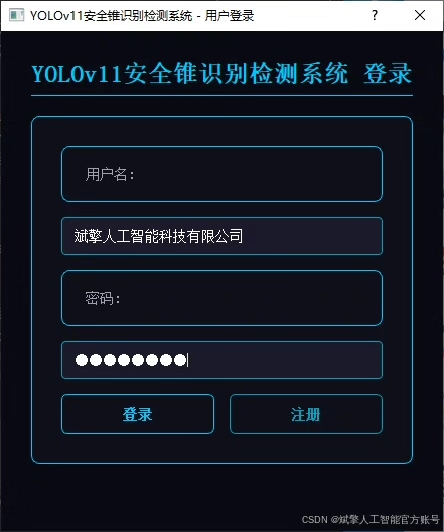
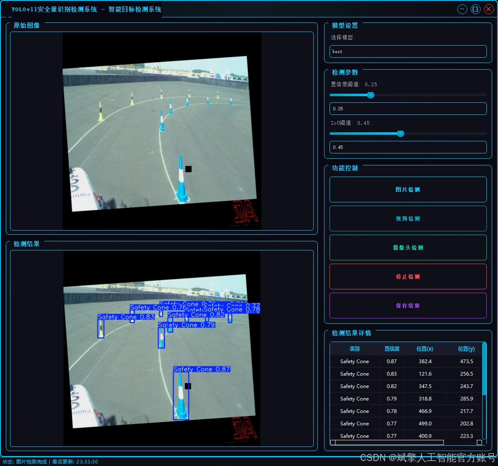
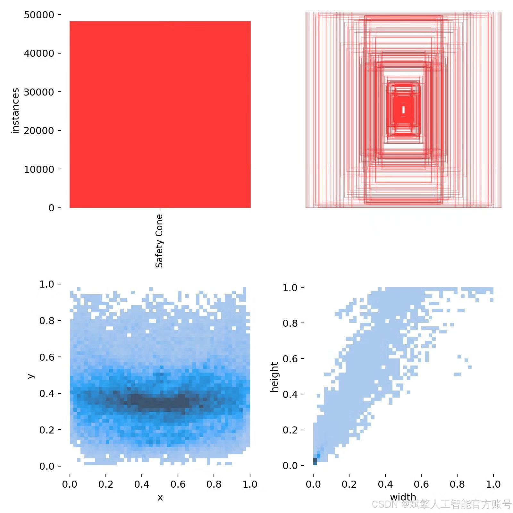
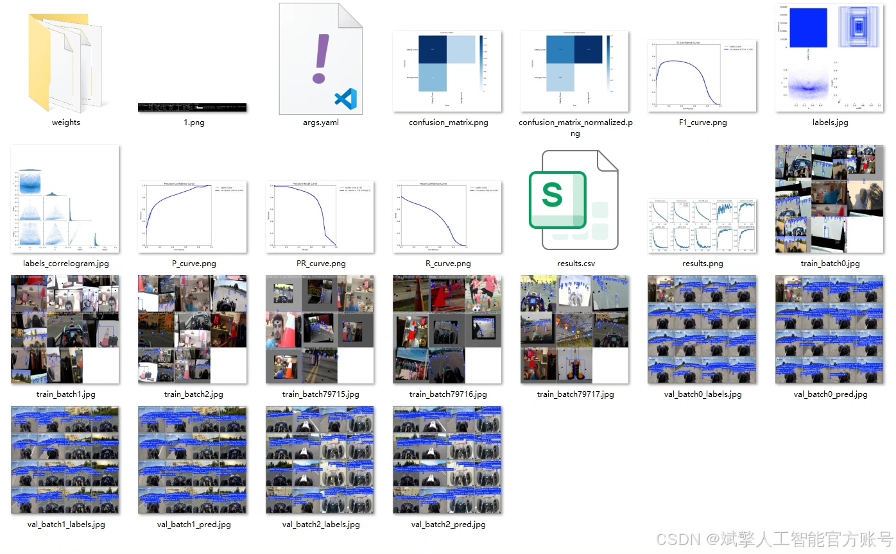
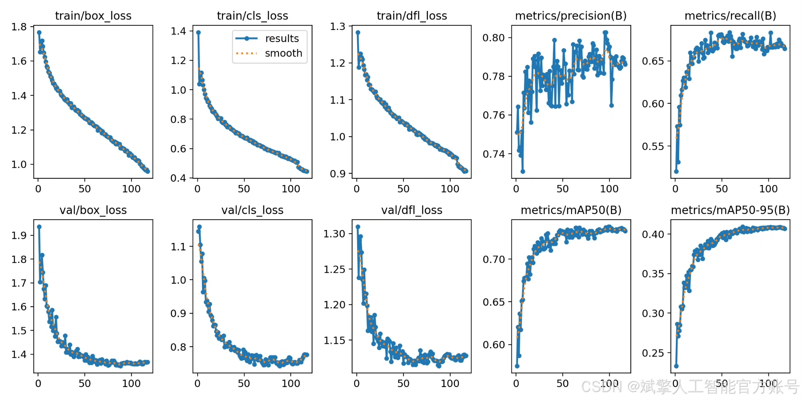
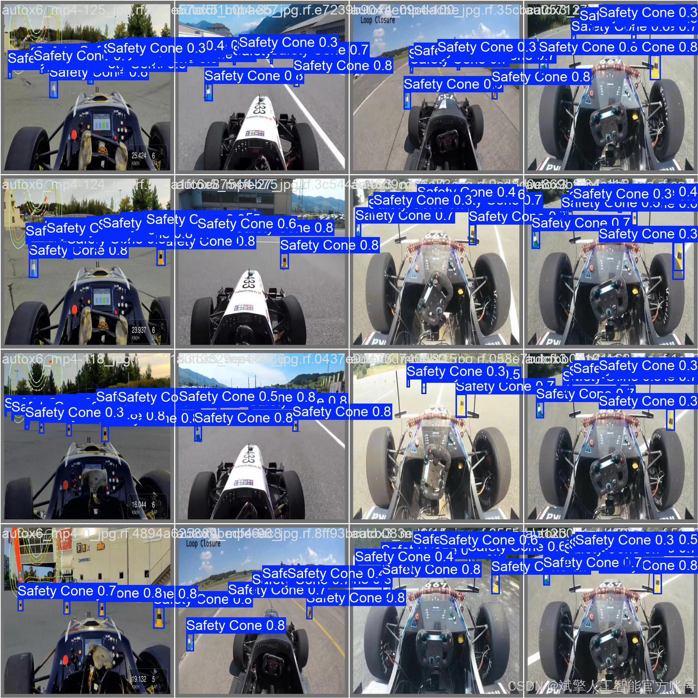
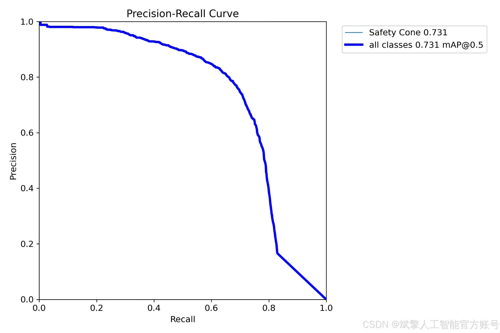

# YOLOv11 safety cone detection system

## Body

YOLOv11 Safety Cone Detection System Based on Deep Learning: A YOLOv11+YOLO dataset+UI interface+login registration interface+Python project source code+model

This paper proposes a target detection system based on deep learning, using the YOLOv11 algorithm to achieve efficient recognition and detection of safety cones. The system is centered around YOLOv11, combined with a labeled dataset containing 5960 training sets, 341 validation sets, and 170 test sets for model training and optimization, achieving high-precision safety cone detection. Additionally, the system integrates a user-friendly UI interface that supports login registration functions. Experimental results show that the system maintains high detection accuracy and real-time performance in complex environments, and can be widely applied in road construction and traffic management fields. This paper details the system architecture, dataset construction, model training, and interface design, providing complete Python project source code and pre-trained models, offering a reproducible solution for related research.

✅ User Login Registration: Supports password verification and security validation.
✅ Three detection modes: Based on the YOLOv11 model, supporting image, video, and real-time camera detection, accurately recognizing targets.
✅ Dual-screen comparison: Displaying original images and detection results simultaneously on the screen.
✅ Data visualization: Real-time table displaying the category, confidence, and coordinates of detected targets.
✅ Intelligent parameter adjustment: Offering a confidence slide bar to dynamically optimize detection accuracy, adapting to different scene requirements.
✅ Sci-fi style interactive interface: Dark theme paired with dynamic light effects, reducing visual fatigue and improving operational experience.

## Images

## Payment

Here is a pay link on Stripe ( https://buy.stripe.com/3cs8yP7sY87d0vu9AB ). Please contact me lonlonago@foxmail.com after funding $89, and I will send you a complete data files , thank you!

